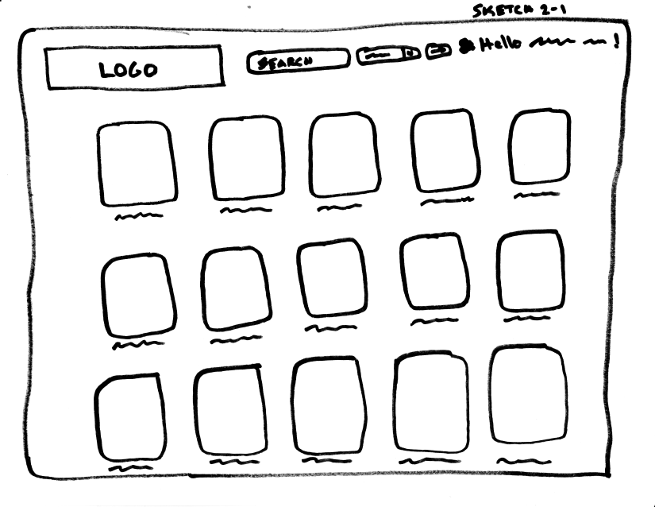
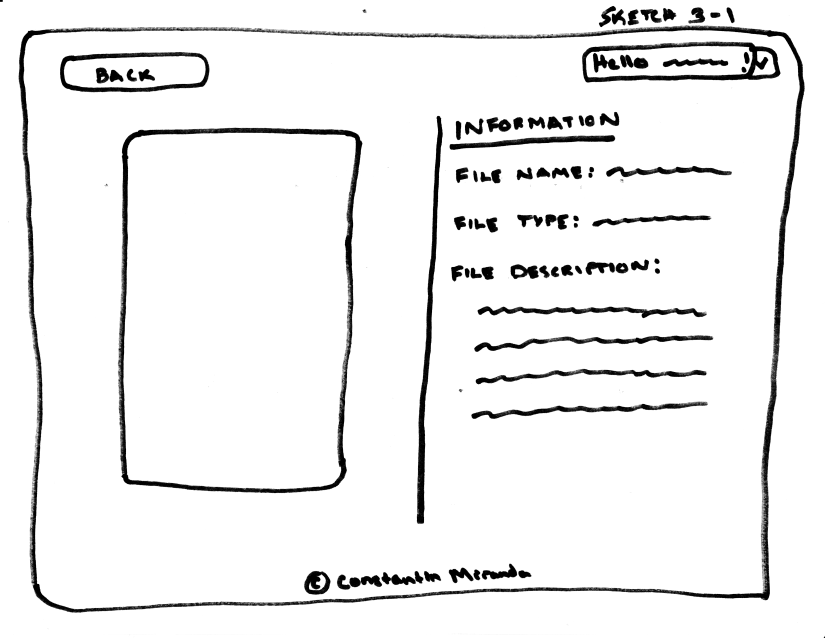
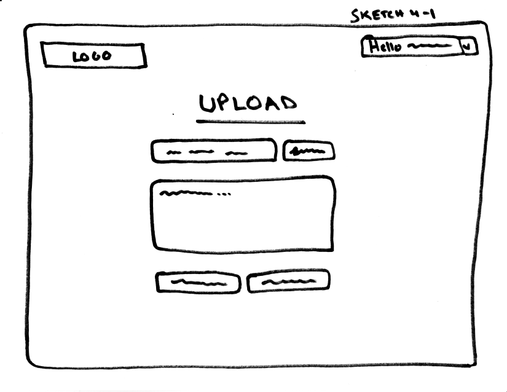
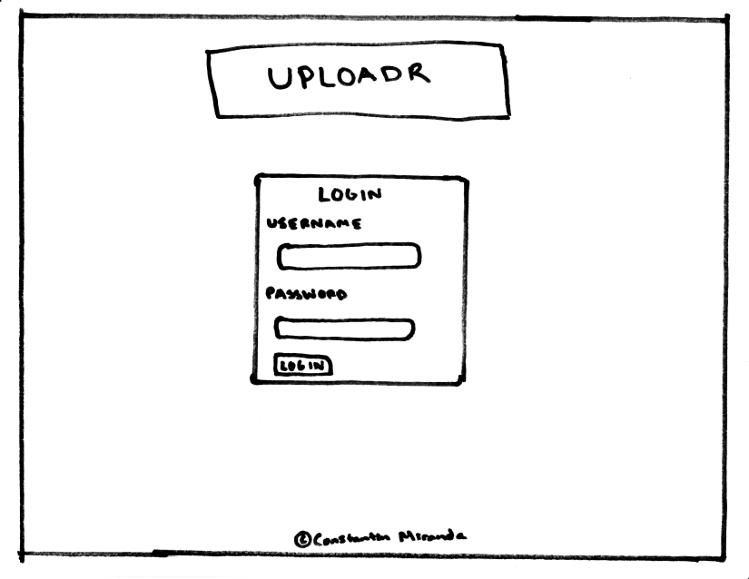
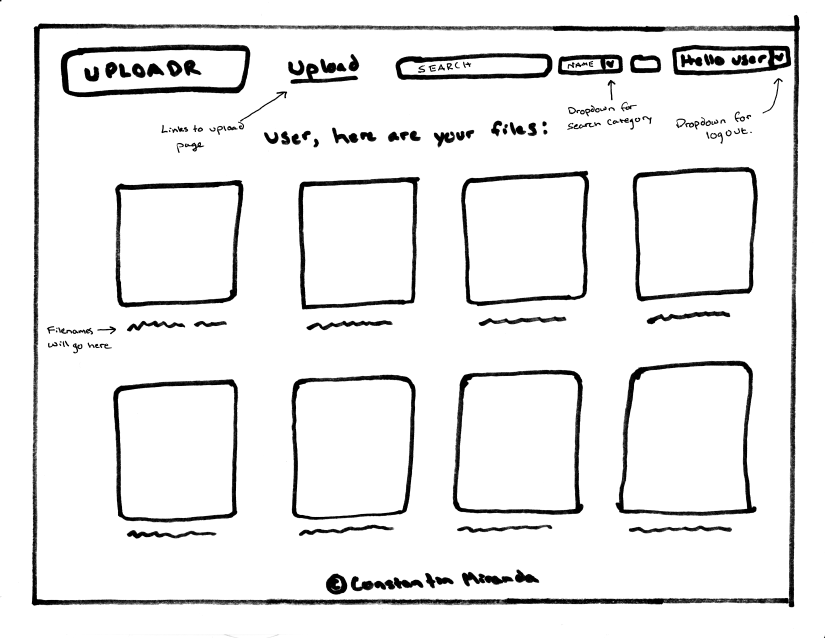
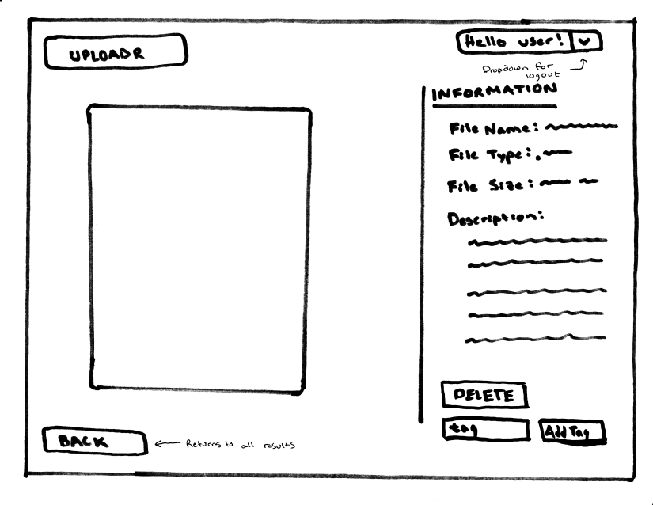
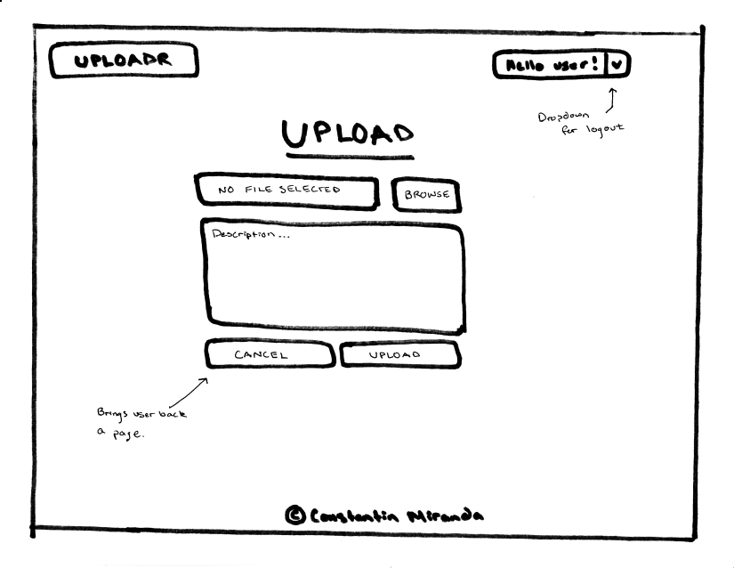
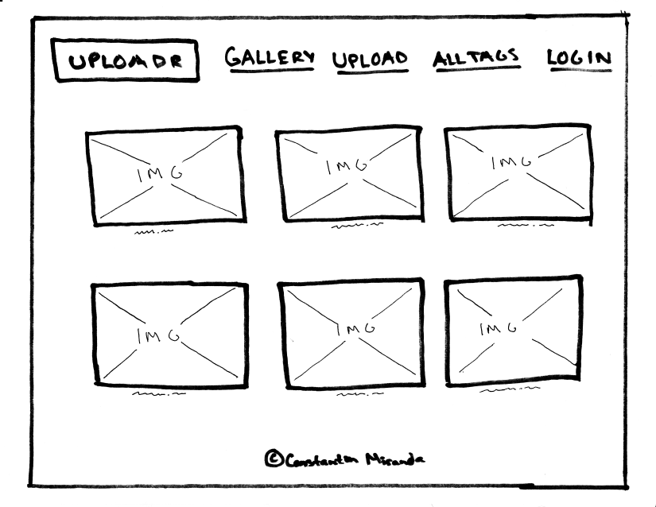
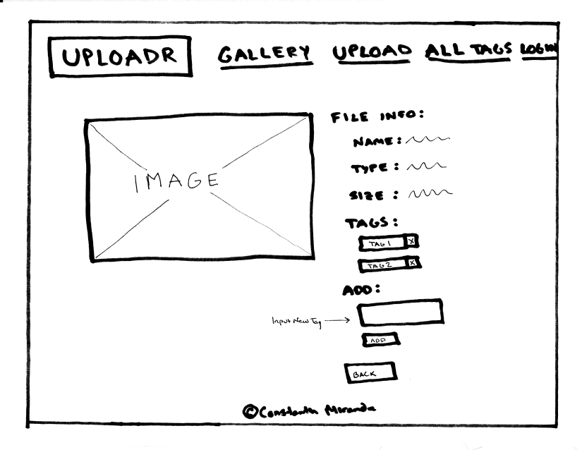
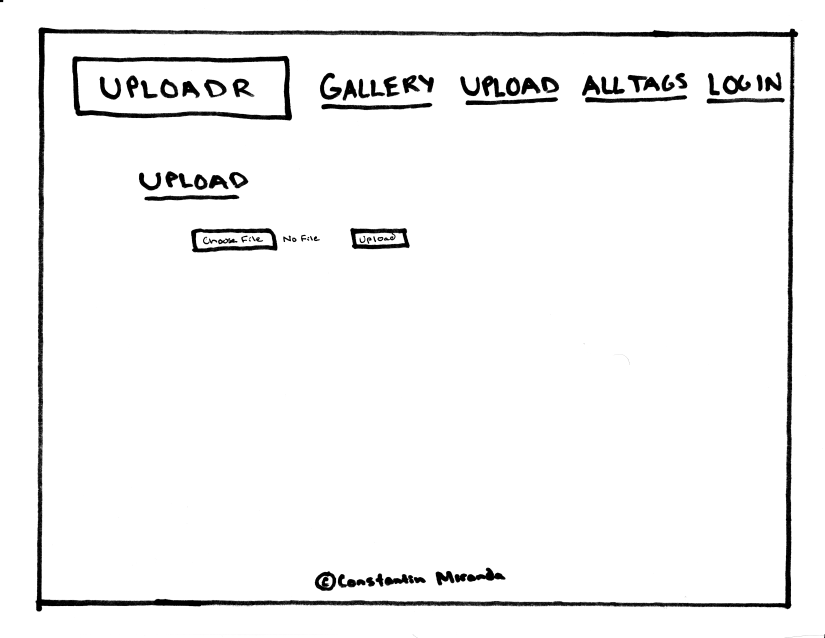

# Project 3 - Design & Plan

Your Name: Constantin Yuri Miranda

## 1. Persona

I've selected **Abby** as my persona.

I selected **Abby** as this project's persona because she gathers information comprehensively to try to form a complete understanding of the problem before trying to solve it, meaning that she will have a lot of knowledge about the product before trying to use it. This means that I will have to provide information to Abby regarding how to use the product. This is especially important because she blames herself for any problems if she eventually cannot figure out how to use it.

## 2. Sketches & Wireframes

### Sketches

Login Page Sketches


Gallery Sketches



Single Image View


Upload Page

### Wirefames
Login Page


Gallery


Single Image View


Upload Interface


### Updated Wireframes
**After receiving feedback on my milestones, I made the following changes to my wireframes.**

**Gallery**
I was not aware that we did not need to implement search functionality. Therefore, I redesigned my header to remove this functionality and include clear, distinct links to functions that **Abby** would want to easily access. Furthermore, I made it so that each image could be clicked as well and added a hovering opacity change effect to make it even more clear to Abby that she could click on the photos. 



**Single Image View**
As one of my milestone graders pointed out, most of the information I wanted to display could be pulled from the file upon upload. So I modified my design to reflect the information that **Abby** would want to see without actually entering anything (making the entire site much more streamlined for her). When I ultimately coded this page up, I made the information labels even clearer ('File Name' instead of 'Name'; 'Return to Gallery' instead of 'Back') for various buttons and field labels.



**Upload Interface**
As explained above, **Abby** shouldn't need to input file information because 1) this makes the entire upload process far more confusing for her and 2) that information can be pulled more accurately from the file that she uploads. Thus, the upload interface was stripped down to just the file selector and upload button. When I ultimately coded the 'upload' page, I made sure to include messages for the user when files could/couldn't be uploaded, whether they were correctly logged in or not, and a note about the maximum file size possible for upload.



[Explain why your design would be effective for your persona. 1-3 sentences.]

This design is effective for my persona because it is an extremely simple interface. Furthermore, every button and field is labeled, meaning that it will be difficult for her to not understand and blame herself.


## 3. Database Schema Plan

[Describe the structure of your database. You may use words or a picture. A bulleted list is probably the simplest way to do this.]

My plan is to have three tables: users, photo_database, and tags. The first table is very self-explanatory. The latter two tables will make it very easy to pull either all images or images based on a tag.

Table: users
* field 1: id AUTOINCREMENT UNIQUE NOT NULL PRIMARY KEY
* field 2: first_name INTEGER NOT NULL
* field 3: last_name TEXT NOT NULL
* field 4: email TEXT NOT NULL UNIQUE
* field 5: password TEXT NOT NULL
* filed 6: session TEXT NOT NULL UNIQUE

Table: photo_database
* field 1: file_id INTEGER AUTOINCREMENT UNIQUE NOT NULL PRIMARY KEY
* field 2: file_name TEXT NOT NULL
* field 3: file_extension TEXT NOT NULL
* field 4: file_size BLOB NOT NULL
* field 5: uploader INTEGER NOT NULL
* field 6: file_tags TEXT

Table: tags
* field 1: tagname TEXT UNIQUE NOT NULL
* field 2: file_path_withtag TEXT NOT NULL

## Updated Database Schema Plan

**I needed to re-plan my database after receiving feedback from my milestone graders and learning more about databases in class and in lab. I drew the following diagram (including primary/foreign key relationships -- something I was lacking before completely) to help me think about the database design:**


Table: users
* field 1: id INTEGER NOT NULL PRIMARY KEY AUTOINCREMENT UNIQUE
* field 2: first_name TEXT NOT NULL
* field 3: last_name TEXT NOT NULL
* field 4: email TEXT NOT NULL UNIQUE
* field 5: password TEXT NOT NULL
* field 6: session TEXT UNIQUE

Table: photo_database
* field 1: file_id INTEGER NOT NULL PRIMARY KEY AUTOINCREMENT UNIQUE
* field 2: folder TEXT
* field 3: file_name TEXT NOT NULL UNIQUE
* field 4: file_extension TEXT NOT NULL
* field 5: file_size NUMBER NOT NULL
* field 6: uploader INTEGER NOT NULL
* FOREIGN KEY (uploader) REFERENCES users(id)

Table: tags
* field 1: tag_id INTEGER NOT NULL PRIMARY KEY AUTOINCREMENT UNIQUE
* field 2: tag_name TEXT NOT NULL UNIQUE

Table: photo_tags
* field 1: tag INTEGER NOT NULL
* field 2: photo INTEGER NOT NULL
* FOREIGN KEY (tag) REFERENCES tags(tag_id)
* FOREIGN KEY (photo) REFERENCES photo_database(file_id)


## 4. Database Query Plan

[Plan your database queries. You may use natural language, pseudocode, or SQL.]

**Since I changed my table structure, some changes had to be made to the DB Query Plan, they are included below.**

**DISPLAY ALL IMAGES FOR USER**
```
SELECT file_name and file_extension FROM photo_database WHERE uploader = user who is logged in;
```
CHANGED TO:
```
SELECT SELECT * FROM photo_database;
```

**DISPLAY IMAGES BY TAG**
```
SELECT file_path_withtag FROM tags WHERE tag = searched tag
```
CHANGED TO:
```
SELECT photo FROM photo_tags WHERE tag = tag;
```

**DISPLAY SPECIFIC IMAGE**
```
SELECT file_name and file_extension FROM photo_database WHERE file_id = image search;
```
CHANGED TO:
```
SELECT * FROM photo_database WHERE file_name = filename;
```

**DISPLAY TAGS FOR SPECIFIC IMAGE**
```
SELECT file_tags FROM photo_database WHERE file_id = specific image id'
```
CHANGED TO:
```
SELECT tag_name FROM tags JOIN photo_tags ON tags.tag_id = photo_tags.tag WHERE photo_tags.photo = (SELECT photo_database.file_id FROM photo_database WHERE photo_database.file_name = filename);
```

**REMOVE IMAGE FROM DATABASE**
```
DELETE * FROM photo_database WHERE file_id = image id to delete;
```

**ADD TAG TO LIST OF TAGS**
```
INSERT INTO tags [(tagname, file_path_withtag)] VALUES [(tag to add, file to add tag to)];
```
CHANGED TO:
```
SELECT * FROM tags WHERE tag_name = tag to add
```

**ADD TAG TO IMAGE**
```
INSERT INTO photo_database [(file_tags)] VALUES [(tag to add to image)] WHERE photo_id = id of image tag is being added to;

```
and
```
INSERT INTO tags [(file_path_withtag)] VALUES [(file path)] WHERE tagname = tag to which image is being added;
```

**REMOVE TAG FROM IMAGE**
```
DELETE file_tags FROM photo_database WHERE photo_id = id of image tag is being removed from;
```
CHANGED TO:
```
DELETE FROM photo_tags WHERE tag = tagid and photo = photoid;
```

**ADD IMAGE TO GALLERY**
```
INSERT INTO photo_database [(file_name), (file_extension), (file_size), (uploader), (file_tags)] VALUES [(user specified file name), (file extension), (image file size), (user who uploaded file), (user specified tags)];
```
CHANGED TO:
```
INSERT INTO photo_database (folder, file_name, file_extension, file_size, uploader) VALUES ("", name, extension, size, uploader);
```

**ADD SESSION TO USER**
```
INSERT INTO users [(session)] VALUES [(randomly generated session id)];
```

**REMOVE SESSION FROM USER**
```
INSERT INTO users [(session)] VALUES [(NULL)];
```

## 5. Structure and Pseudocode

### Structure

[List the PHP files you will have. You will probably want to do this with a bulleted list.]

* includes/init.php - stuff that useful for every web page.
* includes/header.php - header
* includes/footer.php - footer
* index.php - Login page
* singleimage.php - page for single image
* gallery.php - page for all photos and search results
* upload.php - page for upload interface

I also added the following pages:
* addtag.php
* deletefile.php
* deletetag.php
* logout.php
* singletag.php

### Pseudocode

[For each PHP file, plan out your pseudocode. You probably want a subheading for each file.]

#### index.php

```
Pseudocode for index.php...

include init.php

include header.php

<title>Login to Uploadr</title>
 //Centered

<form>
  <input type=email name=username>
  <input type=text name=password>
  <button>Login</button>
</form>

include footer.php
```

### gallery.php

```
include init.php
include header.php

<title> Gallery </title>


<?php


  if (!searching) {
    $SQL = "SELECT * FROM photo_database"
    $photos = sql_function($db, $SQL, $params);
    $params = array (
        //insert params here
      );
    foreach (photos as photo) {
      echo ""
    }
  } else if (searching && searchcat="name") {
    $SQL = "SELECT * FROM photo_database WHERE file_name="name";
    $photos = sql_function($db, $SQL, $params);
    $params = array (
        //insert params here
      );
    foreach (photos as photo) {
      echo ""
    } else if... //Repeat 'else if' statements for the rest of the search categories.
  }
include footer.php

?>

```

### singleimage.php

```
include init.php
include header.php

//USE GET to determine which photo the user wants to display

if (user is logged in) {
  $SQL = "SELECT * FROM photo_database WHERE file_name="name";
  $photos = sql_function($db, $SQL, $params);
  $params = array (
      //insert params here
    );
  echo image; //display image
  echo file name;
  echo file type;
  echo file description;
  echo file size;
} else {
  echo "not logged in";
}

include footer.php

```

### upload.php

```
Pseudocode for upload.php


include init.php
include header.php

<form>
  <input file upload>
  <input type="textarea"> //description
  <button for cancel>
  <button for submit> //Runs 'add to database' SQL functions
</form>

```

#### includes/init.php

```
messages = array to store messages for user (you may remove this)

// DB helper functions (you do not need to write this out since they are provided.)

db = connect to db

...

```

#### header.php

```
Pseudocode for header.PHP

<header>
<nav id="menu">
    <ul>
      <li>
        
      </li>
      <li>
        <form>
          <input type="text" name="search">
          <select name="search category">
            <option value="name">Name</option>
            <option value="size">File Size</option>
            <option value="tag">Tag</option>
          </select>
          <button type="submit">
        </form>
      </li>
      <li>
        Implement dropdown for "Hello User" box to give user the option to log out.
      </li>
    </ul>
  </nav>
</header>
```

### footer.php

```
Pseudocode for footer.php

<p> {copyright symbol} Constantin Miranda </p>

```

## 6. Seed Data - Username & Passwords

[List the usernames and passwords for your users]

* user1: Constantin Miranda cym8@cornell.edu; password: password1
* user2: user2@gmail.com; password: info2300-pw
